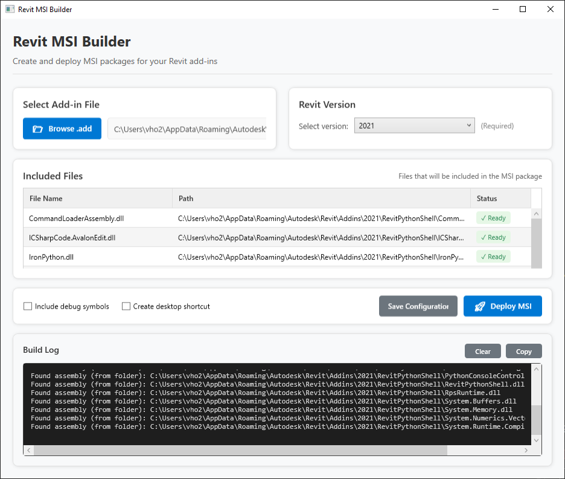

# Revit Msi Builder WPF

Revit Msi Builder WPF is a lightweight tool to package and deploy Revit Add-ins as MSI installers. Built with a WPF frontend and CLI backend, it helps developers distribute add-ins across multiple Revit versions with ease and consistency.

# Prerequisites

- Install .NET 6.0 SDK or later.
- Install Wix 
```
dotnet tool install --global wix
```

# 🖥️ User Interface

The WPF frontend allows you to:

- 📂 Select .addin file via file browser

- 🔽 Choose Revit versions from a dropdown

- 📄 See input files in a DataGrid

- 🛠 Deploy and view real-time logs



